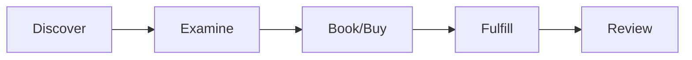
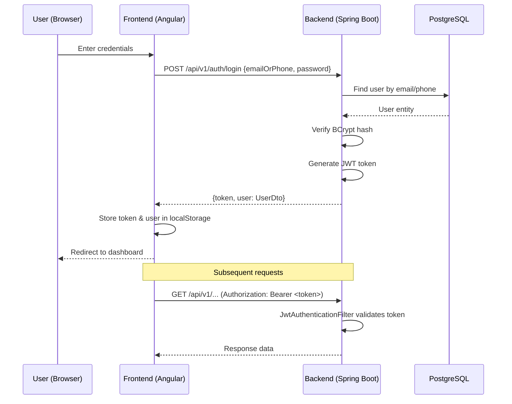
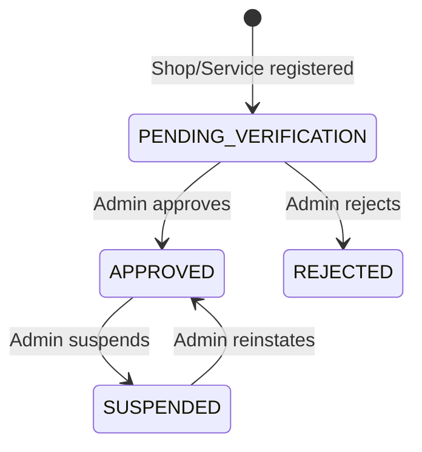
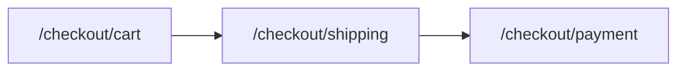

# Core Features & Logic

## 1. User Interaction Flow

Nikat is centered around the discovery, booking, and review of local services and shops. The core interaction model follows this pipeline:

1. **Discover**: Users open the platform, explore categories, view advertisements, use the search bar, or browse listed services and shops.
2. **Examine**: Users view specific Shop or Service profiles detailing services offered, pricing, contact info, operating hours, and existing reviews.
3. **Book/Buy**: The User initiates a booking via "Book Now". The backend creates an appointment/transaction record.
4. **Fulfill**: The Service Provider or Shop Owner reviews and completes the appointment.
5. **Review**: The Customer leaves a rating (1–5 stars) and written review for the completed service.

---

## 2. Authentication & Authorization

### Authentication Flow
The platform uses **JWT-based stateless authentication** via Spring Security 6.

### Registration Flow
1. User fills registration form: firstName, lastName, phone, email, password, role
2. `POST /api/v1/auth/register` → Backend creates user with:
   - Password hashed via BCrypt
   - `status: PENDING_VERIFICATION`
   - `emailVerified: false`
   - `role: USER` (default)
3. Returns JWT token + UserDto for immediate session

### Token Storage (Frontend)
| Key | Value | Purpose |
|-----|-------|---------|
| `nikat_token` | JWT string | Attached by `apiInterceptor` to all HTTP requests |
| `nikat_user` | JSON-serialized `UserDto` | Quick access to user info without decoding JWT |

### Logout
- `AuthService.logout()`: Removes `nikat_token` and `nikat_user` from localStorage, sets `currentUser$` to null.
- Frontend guards redirect unauthenticated users to `/login`.

---

## 3. Role-Based Access Control

### Roles & Route Protection
| Role | Guard | Protected Routes | Access Level |
|------|-------|-----------------|--------------|
| **USER** | `roleGuard` (`expectedRole: 'USER'`) | `/dashboard` | Standard consumer features |
| **Shop Owner** | `roleGuard` (`expectedCondition: 'isShopOwner'`) | `/shop-dashboard` | Shop management, appointments |
| **Service Provider** | `roleGuard` (`expectedCondition: 'isServiceProvider'`) | `/provider-dashboard` | Service management |
| **ADMIN** | `adminGuard` (`role === 'ADMIN'`) | `/admin/**` | Full platform control |

### Guard Logic
- **`authGuard`**: Simplest check — is `nikat_token` present in localStorage? Used for checkout shipping/payment.
- **`adminGuard`**: Parses `nikat_user` from localStorage, checks `role === 'ADMIN'`. Redirects to `/admin-login` if not authenticated, or `/` if authenticated but not admin.
- **`roleGuard`**: Flexible — reads `expectedRole` or `expectedCondition` from route `data`. Supports both role-based (`USER`, `ADMIN`) and condition-based (`isShopOwner`, `isServiceProvider`) checks.

### Admin-Specific Capabilities
The admin panel is nested under `AdminLayoutComponent` with a sidebar navigation and 12 sub-pages:

| Sub-Page | Route | Purpose |
|----------|-------|---------|
| Dashboard | `/admin` | Platform overview & key metrics |
| Users | `/admin/users` | View & manage all users |
| Shops | `/admin/shops` | View & manage all shops |
| Services | `/admin/services` | View & manage all services |
| Categories | `/admin/categories` | Create/edit categories |
| Reviews | `/admin/reviews` | Moderate reviews |
| Reports | `/admin/reports` | Analytics & reports |
| Approvals | `/admin/approvals` | Approve/reject pending shops & services |
| Advertisements | `/admin/advertisements` | Manage promotional banners |
| Platform Stats | `/admin/stats` | Detailed platform metrics |
| Security Logs | `/admin/security` | Audit trail |
| Community Hub | `/admin/community-hub` | Moderate community posts |
| Settings | `/admin/settings` | System configuration |

---

## 4. Verification & Approval Pipeline

1. When a Shop or Service is registered, it starts with `status: PENDING_VERIFICATION`.
2. While pending, the shop/service is **not publicly visible** in search or browse results.
3. Admins use the **Approvals** tab (`/admin/approvals`) to review legitimacy.
4. Upon approval (`status: APPROVED`), the entity becomes publicly discoverable.
5. Admins can also suspend approved entities if violations are detected.

---

## 5. Community Board

The community feature allows neighborhood engagement with categorized posts:

| Post Type | Code | Description |
|-----------|------|-------------|
| Cab Pool | `CAB_POOL` | Share rides with neighbors |
| Games | `GAMES` | Organize local sports/gaming sessions |
| Marketplace | `MARKETPLACE` | Buy/sell items locally |
| Issue | `ISSUE` | Report neighborhood issues |
| Hosted Room | `HOSTED_ROOM` | Room/space availability listings |

Posts have `status: ACTIVE` by default and can be moderated via the admin Community Hub.

---

## 6. Checkout Flow

A three-step checkout process for purchasing products:

| Step | Route | Auth | Description |
|------|-------|------|-------------|
| Cart | `/checkout/cart` | None | View and manage cart items |
| Shipping | `/checkout/shipping` | `authGuard` | Enter delivery address |
| Payment | `/checkout/payment` | `authGuard` | Complete payment |

---

## 7. Backend Logic Validation Rules

1. **Price Verification**: All pricing and scheduling calculations must be verified by the backend. Never trust client-submitted prices — always query the DB for the authoritative price.
2. **Double-Booking Prevention**: The backend must validate appointment conflicts and throw appropriate errors.
3. **API Spoofing Protection**: Re-calculating totals server-side prevents direct API manipulation.
4. **Error Communication**: Backend throws structured errors → Frontend gracefully displays user-friendly messages.
5. **Email Notifications**: The `EmailService` (Resend API) sends transactional emails for appointment confirmations and status changes.

---

## 8. Public vs Protected API Endpoints

| Category | Endpoint Pattern | Auth Required | Example Operations |
|----------|-----------------|---------------|-------------------|
| Auth | `/api/v1/auth/**` | No | Register, Login |
| Public Browse | `/api/v1/public/shops` | No | List approved shops |
| Public Browse | `/api/v1/public/services` | No | List approved services |
| Public Browse | `/api/v1/public/categories` | No | List all categories |
| Public Browse | `/api/v1/public/reviews` | No | List active reviews |
| Public Browse | `/api/v1/public/community` | No | List community posts |
| User Operations | `/api/v1/users/**` | JWT | Profile management |
| Shop Management | `/api/v1/shops/**` | JWT | CRUD for shop owners |
| Service Management | `/api/v1/services/**` | JWT | CRUD for providers |
| Admin Operations | `/api/v1/admin/**` | JWT (ADMIN) | Platform management |
