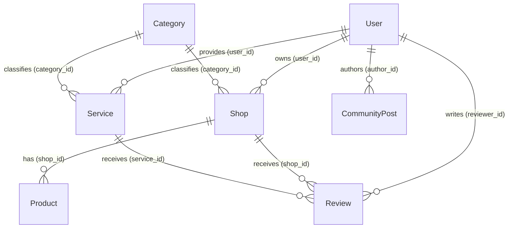

# Data Models & Structure

## 1. Overview
Nikat uses PostgreSQL (hosted on Neon.tech) as its relational database, managed via Spring Data JPA with Flyway for schema migrations. The database schema is defined in `backend/src/main/resources/db/migration/V1__Initial_Schema.sql` and validated at startup by JPA in `ddl-auto=validate` mode.

All primary keys are **UUIDs** generated by JPA (`@GeneratedValue(strategy = GenerationType.UUID)`).

---

## 2. Entity Relationship Diagram

---

## 3. Core Entities (8 Tables)

### Users (`users`)
Represents all individuals logging into the system. Distinguished by `role`, `isShopOwner`, and `isServiceProvider` flags.

| Column | Type | Constraints | Notes |
|--------|------|------------|-------|
| `id` | UUID | PK | Auto-generated |
| `first_name` | VARCHAR(100) | NOT NULL | |
| `last_name` | VARCHAR(100) | | |
| `phone` | VARCHAR(20) | NOT NULL, UNIQUE | |
| `email` | VARCHAR(150) | NOT NULL, UNIQUE | |
| `gender` | VARCHAR(20) | | |
| `address` | TEXT | | |
| `location_coordinates` | POINT | | Geospatial (DB only, not in JPA entity) |
| `password_hash` | VARCHAR(255) | NOT NULL | BCrypt hashed |
| `photo_url` | VARCHAR(255) | | Profile picture URL |
| `aadhar_number` | VARCHAR(50) | | Indian ID document |
| `pan_number` | VARCHAR(20) | | Indian tax ID |
| `passport_number` | VARCHAR(50) | | |
| `role` | VARCHAR(50) | DEFAULT 'USER' | Values: `USER`, `ADMIN`, `SHOP_OWNER`, `SERVICE_PROVIDER` |
| `is_shop_owner` | BOOLEAN | DEFAULT FALSE | |
| `is_service_provider` | BOOLEAN | DEFAULT FALSE | |
| `status` | VARCHAR(50) | DEFAULT 'PENDING_VERIFICATION' | |
| `email_verified` | BOOLEAN | DEFAULT FALSE | |
| `created_at` | TIMESTAMP | DEFAULT CURRENT_TIMESTAMP | Set by `@PrePersist` |
| `updated_at` | TIMESTAMP | DEFAULT CURRENT_TIMESTAMP | Set by `@PreUpdate` |

### Categories (`categories`)
Shared classification for both shops and services.

| Column | Type | Constraints | Notes |
|--------|------|------------|-------|
| `id` | UUID | PK | |
| `name` | VARCHAR(150) | NOT NULL, UNIQUE | |
| `description` | TEXT | | |
| `is_service_category` | BOOLEAN | DEFAULT FALSE | Category applies to services |
| `is_shop_category` | BOOLEAN | DEFAULT FALSE | Category applies to shops |
| `created_at` | TIMESTAMP | DEFAULT CURRENT_TIMESTAMP | |

### Shops (`shops`)
Represents a registered business. Starts as `PENDING_VERIFICATION` until admin approves.

| Column | Type | Constraints | Notes |
|--------|------|------------|-------|
| `id` | UUID | PK | |
| `user_id` | UUID | NOT NULL, FK → `users(id)` | Shop owner reference |
| `name` | VARCHAR(200) | NOT NULL | |
| `category_id` | UUID | FK → `categories(id)` | |
| `worker_count` | INT | | Number of employees |
| `description` | TEXT | | |
| `address` | TEXT | | |
| `location_coordinates` | POINT | | Geospatial (DB only) |
| `opening_hours` | VARCHAR(255) | | Free-text schedule |
| `status` | VARCHAR(50) | DEFAULT 'PENDING_VERIFICATION' | `PENDING_VERIFICATION`, `APPROVED`, `REJECTED`, `SUSPENDED` |
| `is_featured` | BOOLEAN | DEFAULT FALSE | Admin can feature shops |
| `created_at` | TIMESTAMP | | |
| `updated_at` | TIMESTAMP | | |

### Services (`services`)
Represents distinct offerings provided by service providers.

| Column | Type | Constraints | Notes |
|--------|------|------------|-------|
| `id` | UUID | PK | |
| `user_id` | UUID | NOT NULL, FK → `users(id)` | Provider reference |
| `name` | VARCHAR(200) | NOT NULL | |
| `category_id` | UUID | FK → `categories(id)` | |
| `description` | TEXT | | |
| `service_area` | TEXT | | Geographic coverage area |
| `start_time` | TIME | | Operating start time |
| `end_time` | TIME | | Operating end time |
| `base_charge` | DECIMAL(10,2) | | Price for the service |
| `status` | VARCHAR(50) | DEFAULT 'PENDING_VERIFICATION' | |
| `is_featured` | BOOLEAN | DEFAULT FALSE | |
| `created_at` | TIMESTAMP | | |
| `updated_at` | TIMESTAMP | | |

### Products (`products`)
Items sold by shops.

| Column | Type | Constraints | Notes |
|--------|------|------------|-------|
| `id` | UUID | PK | |
| `shop_id` | UUID | NOT NULL, FK → `shops(id)` | Parent shop |
| `name` | VARCHAR(200) | NOT NULL | |
| `description` | TEXT | | |
| `price` | DECIMAL(10,2) | | |
| `is_available` | BOOLEAN | DEFAULT TRUE | Soft availability toggle |
| `image_url` | VARCHAR(255) | | Product image |
| `created_at` | TIMESTAMP | | |

### Reviews (`reviews`)
Customer feedback for shops or services. Can target either a shop or a service (or both).

| Column | Type | Constraints | Notes |
|--------|------|------------|-------|
| `id` | UUID | PK | |
| `reviewer_id` | UUID | NOT NULL, FK → `users(id)` | Author of the review |
| `shop_id` | UUID | FK → `shops(id)` | Nullable — review targets a shop |
| `service_id` | UUID | FK → `services(id)` | Nullable — review targets a service |
| `rating` | INT | CHECK (1–5) | Star rating |
| `comment` | TEXT | | Review text |
| `status` | VARCHAR(50) | DEFAULT 'ACTIVE' | `ACTIVE`, `HIDDEN`, `FLAGGED` |
| `created_at` | TIMESTAMP | | |

### Community Posts (`community_posts`)
Community board entries for neighborhood engagement.

| Column | Type | Constraints | Notes |
|--------|------|------------|-------|
| `id` | UUID | PK | |
| `author_id` | UUID | NOT NULL, FK → `users(id)` | Post author |
| `post_type` | VARCHAR(50) | NOT NULL | `CAB_POOL`, `GAMES`, `MARKETPLACE`, `ISSUE`, `HOSTED_ROOM` |
| `title` | VARCHAR(255) | NOT NULL | |
| `content` | TEXT | | |
| `location_area` | VARCHAR(150) | | Neighborhood/area reference |
| `status` | VARCHAR(50) | DEFAULT 'ACTIVE' | |
| `created_at` | TIMESTAMP | | |

### Advertisements (`advertisements`)
Promotional banners managed by admins.

| Column | Type | Constraints | Notes |
|--------|------|------------|-------|
| `id` | UUID | PK | |
| `title` | VARCHAR(200) | | Banner title |
| `image_url` | VARCHAR(255) | NOT NULL | Banner image |
| `target_link` | VARCHAR(255) | | Click-through URL |
| `display_order` | INT | | Sort priority |
| `status` | VARCHAR(50) | DEFAULT 'ACTIVE' | |
| `created_at` | TIMESTAMP | | |

---

## 4. Frontend DTO Interfaces

Frontend TypeScript interfaces are defined in `core/auth.service.ts` and `core/api.service.ts`. They **must** mirror the backend DTOs exactly:

| Interface | File | Key Fields |
|-----------|------|------------|
| `UserDto` | `auth.service.ts` | id, firstName, lastName, phone, email, role, isShopOwner, isServiceProvider, status |
| `AuthResponse` | `auth.service.ts` | token, user (UserDto) |
| `RegisterRequest` | `auth.service.ts` | firstName, lastName, phone, email, password, role |
| `AuthRequest` | `auth.service.ts` | emailOrPhone, password |
| `ShopDto` | `api.service.ts` | id, ownerId, ownerName, name, categoryName, categoryId, workerCount, description, address, openingHours, status, isFeatured |
| `ServiceDto` | `api.service.ts` | id, providerId, providerName, name, categoryName, categoryId, description, serviceArea, startTime, endTime, baseCharge, status, isFeatured |
| `CategoryDto` | `api.service.ts` | id, name, description, isServiceCategory, isShopCategory |

---

## 5. Data Integrity Rules

1. **Single Source of Truth**: The Flyway migration (`V1__Initial_Schema.sql`) and JPA entity annotations define the true schema. JPA runs in `validate` mode — mismatches cause startup failure.
2. **Schema Changes**: Always create new Flyway versioned migrations (`V2__`, `V3__`, etc.). Never modify existing migrations.
3. **Frontend Mirrors**: Frontend TypeScript interfaces must exactly match the fields returned by backend DTOs. If a field is needed, add it to the backend Entity → DTO → then frontend interface.
4. **Referential Integrity**: Foreign keys prevent orphaned records. Cascading behavior should be explicitly defined per relationship.
5. **Validation**: Nullability, length limits, and unique constraints are enforced at the DB level (via Flyway) and validated by JPA annotations on entities.
6. **Soft Deletes**: Prefer soft-delete patterns (`status = 'INACTIVE'`, `isAvailable = false`) over `DELETE` operations for critical entities.
7. **UUID Primary Keys**: All entities use UUID v4 primary keys, auto-generated by JPA.
