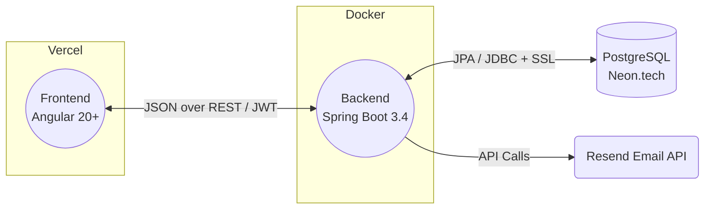

# Nikat — Local Services & Shops Discovery Platform

## 1. Project Overview & Purpose
**Nikat** is a comprehensive, localized services and shops discovery platform designed to connect neighborhoods with premium services. It acts as a bridge between customers looking for specific services (like appliance repair) or products, and listed shops, technicians, or service providers. The purpose is to streamline local discovery, booking, reviews, and community engagement — all in one place through a modern, seamless digital experience.

### Live Deployments
| Layer | URL | Platform |
|-------|-----|----------|
| Frontend | `https://nikat.vercel.app` | Vercel |
| Backend API | `https://nikat.onrender.com/api/v1` | Render.com (Docker) |
| Database | Neon.tech PostgreSQL | `ap-southeast-1` (AWS Singapore) |
| API Docs | `https://nikat.onrender.com/swagger-ui.html` | SpringDoc OpenAPI |

---

## 2. Core Features & Roles

### Roles
| Role | Route Guard | Description |
|------|------------|-------------|
| **Customer / User** | `roleGuard` (`expectedRole: 'USER'`) | Browse shops/services, book appointments, leave reviews, manage profile |
| **Shop Owner** | `roleGuard` (`expectedCondition: 'isShopOwner'`) | List & manage their business, view appointments, track analytics |
| **Service Provider** | `roleGuard` (`expectedCondition: 'isServiceProvider'`) | Manage offered services, receive requests, track ratings |
| **Admin** | `adminGuard` (`role === 'ADMIN'`) | Full platform management — approvals, stats, ads, users, security logs, community hub |

### Features by Role

#### Customer
- Browse & search shops and services by category
- View detailed shop profiles (services, prices, hours, reviews)
- Book services / appointments
- Leave ratings & reviews (1–5 stars + comment)
- Checkout flow (Cart → Shipping → Payment)
- Community board participation (Cab Pool, Games, Marketplace, Issues, Hosted Rooms)
- Light/Dark theme toggle

#### Shop Owner
- Register shop (starts as `PENDING_VERIFICATION`)
- Manage shop profile, opening hours, worker count
- Add/manage products with pricing and images
- View and respond to bookings
- Dedicated Shop Owner Dashboard

#### Service Provider
- Register as service provider
- Manage services (pricing, area, schedule)
- Service Provider Dashboard with analytics

#### Admin (Protected Panel with Sidebar Navigation)
- **Dashboard**: Platform-wide analytics overview
- **Users**: View, manage, suspend users
- **Shops**: Manage all registered shops
- **Services**: View and moderate services
- **Categories**: Create/edit service & shop categories
- **Reviews**: Moderate user reviews
- **Reports**: Platform analytics reports
- **Approvals**: Approve/reject pending shop and service registrations
- **Advertisements**: Manage promotional banners
- **Platform Stats**: Detailed platform metrics
- **Security Logs**: Authentication and access audit trail
- **Community Hub**: Moderate community posts
- **Settings**: System configuration

### Business Flowchart


---

## 3. Technology Stack & Architecture

### Frontend
| Aspect | Detail |
|--------|--------|
| Framework | **Angular 20** (Standalone Components, no `AppModule`) |
| Language | **TypeScript 5.9** |
| Styling | **Vanilla CSS** with CSS Custom Properties (Deep Sea / Glassmorphism design system) |
| Fonts | Plus Jakarta Sans (headings), Manrope (body) — via Google Fonts |
| State | Angular Signals + RxJS BehaviorSubjects |
| Routing | Lazy-loaded standalone components with `loadComponent()` |
| Auth | HTTP interceptor (`apiInterceptor`) attaches JWT Bearer token |
| Guards | `authGuard`, `adminGuard`, `roleGuard` — all functional `CanActivateFn` guards |
| Theme | `ThemeService` with Angular Signals — dark-mode default, light-mode via `.light-theme` class |
| Root Component | `App` (`app.ts`) — includes smart dashboard routing based on user role/flags |
| App Config | `provideZoneChangeDetection`, `provideRouter`, `provideHttpClient` with `apiInterceptor` |
| Deployment | **Vercel** (`vercel.json` SPA rewrite to `/index.html`) |
| Testing | Jasmine + Karma |

### Backend
| Aspect | Detail |
|--------|--------|
| Framework | **Spring Boot 3.4.0** |
| Language | **Java 21** |
| Security | Spring Security 6 — Stateless JWT (`jjwt 0.11.5`), BCrypt password hashing |
| ORM | Spring Data JPA + Hibernate (PostgreSQL dialect) |
| Migrations | **Flyway** (`V1__Initial_Schema.sql`) with `baseline-on-migrate` |
| DTO Mapping | **MapStruct 1.5.5** + **Lombok 1.18.34** |
| API Docs | **SpringDoc OpenAPI 2.7.0** (Swagger UI at `/swagger-ui.html`) |
| Validation | `spring-boot-starter-validation` (Jakarta Bean Validation) |
| Email | Resend API integration for transactional emails |
| Testing | Spring Boot Test, Spring Security Test, Testcontainers (PostgreSQL) |
| Deployment | **Render.com** via multi-stage Docker build (`eclipse-temurin:21`) |

### Database
| Aspect | Detail |
|--------|--------|
| Engine | **PostgreSQL** (Serverless) |
| Host | **Neon.tech** — `ap-southeast-1` (AWS Singapore) |
| Connection | JDBC with SSL (`sslmode=require&channel_binding=require`) |
| Pooling | Connection pooler endpoint |
| Schema Mgmt | Flyway migrations + JPA `ddl-auto=validate` |

### Architecture Flowchart



---

## 4. Repository & Module Breakdown

```
Nikat/
├── AGENTS.md                          # Root agent instruction file
├── README.md                          # This file
├── .agent/                            # AI Agent guidelines & instructions
│   ├── instructions/
│   │   ├── tech-stack-and-architecture.md
│   │   ├── data-models.md
│   │   ├── core-features-and-logic.md
│   │   ├── ui-ux-guidelines.md
│   │   └── agent-workflow-rules.md
│   └── skills/
│       └── angular-best-practices/
├── frontend/                          # Angular 20 SPA
│   ├── src/
│   │   ├── app/
│   │   │   ├── app.ts                 # Root AppComponent
│   │   │   ├── app.routes.ts          # All route definitions
│   │   │   ├── app.config.ts          # App configuration & providers
│   │   │   ├── core/                  # Singleton services, guards, interceptors
│   │   │   │   ├── auth.service.ts    # Auth (login/register/logout/session)
│   │   │   │   ├── api.service.ts     # Public API calls (shops, services, categories)
│   │   │   │   ├── theme.service.ts   # Dark/Light theme via Signals
│   │   │   │   ├── auth.guard.ts      # Generic auth check guard
│   │   │   │   ├── admin.guard.ts     # Admin role check guard
│   │   │   │   ├── role.guard.ts      # Flexible role/condition guard
│   │   │   │   ├── api.interceptor.ts # JWT Bearer token attachment
│   │   │   │   ├── environment.ts     # Dev API URL config
│   │   │   │   ├── environment.prod.ts
│   │   │   │   └── theme-toggle/      # Theme toggle UI component
│   │   │   └── features/              # Feature modules (lazy-loaded)
│   │   │       ├── home/              # Landing page with hero, categories, ads
│   │   │       ├── auth/              # Login, Register, Forgot/Reset Password, OTP, Admin Login
│   │   │       ├── shops/             # Browse shops, Shop detail page
│   │   │       ├── services/          # Services listing, Service booking
│   │   │       ├── search/            # Search results page
│   │   │       ├── reviews/           # Public reviews listing
│   │   │       ├── community/         # Community board
│   │   │       ├── checkout/          # Cart → Shipping → Payment flow
│   │   │       ├── dashboard/         # User dashboard
│   │   │       │   ├── shop-owner/    # Shop owner dashboard
│   │   │       │   └── service-provider/ # Service provider dashboard
│   │   │       ├── admin/             # Admin panel (layout + 12 sub-pages)
│   │   │       └── help/              # Help / FAQ page
│   │   └── styles.css                 # Global CSS variables, theme, utilities
│   ├── vercel.json                    # Vercel SPA deployment config
│   ├── angular.json                   # Angular CLI workspace config
│   └── package.json                   # npm dependencies & scripts
├── backend/                           # Spring Boot 3.4 API
│   ├── src/main/java/com/nikat/api/
│   │   ├── NikatApplication.java      # Spring Boot entry point
│   │   ├── config/
│   │   │   ├── SecurityConfig.java    # CORS, JWT filter chain, stateless sessions
│   │   │   ├── GlobalExceptionHandler.java
│   │   │   └── OpenApiConfig.java     # Swagger/OpenAPI config
│   │   ├── controller/                # REST endpoints (/api/v1/...)
│   │   │   ├── AuthController.java    # /auth/register, /auth/login
│   │   │   ├── ShopController.java    # /public/shops, CRUD
│   │   │   ├── ServiceController.java # /public/services, CRUD
│   │   │   ├── CategoryController.java# /public/categories
│   │   │   ├── ReviewController.java  # /public/reviews
│   │   │   ├── CommunityController.java # /public/community
│   │   │   └── UserController.java    # User management
│   │   ├── domain/                    # JPA Entity classes
│   │   │   ├── User.java
│   │   │   ├── Shop.java
│   │   │   ├── Service.java
│   │   │   ├── Product.java
│   │   │   ├── Category.java
│   │   │   ├── Review.java
│   │   │   ├── CommunityPost.java
│   │   │   └── Advertisement.java
│   │   ├── dto/                       # Data Transfer Objects
│   │   │   ├── AuthRequest.java / AuthResponse.java
│   │   │   ├── RegisterRequest.java
│   │   │   ├── ShopDto.java / ServiceDto.java
│   │   │   ├── CategoryDto.java / ReviewDto.java
│   │   │   ├── ProductDto.java / CommunityPostDto.java
│   │   │   └── UserDto.java
│   │   ├── repository/                # Spring Data JPA repositories
│   │   ├── security/                  # JWT utilities & filters
│   │   │   ├── JwtUtils.java
│   │   │   ├── JwtAuthenticationFilter.java
│   │   │   ├── CustomUserDetails.java
│   │   │   └── CustomUserDetailsService.java
│   │   └── service/                   # Business logic layer (Single Source of Truth)
│   │       ├── AuthService.java
│   │       ├── ShopService.java
│   │       ├── ServiceProviderService.java
│   │       ├── CategoryService.java
│   │       ├── ReviewService.java
│   │       ├── CommunityService.java
│   │       ├── UserService.java
│   │       └── EmailService.java
│   ├── src/main/resources/
│   │   ├── application.properties     # DB connection, Flyway, server config
│   │   └── db/migration/
│   │       └── V1__Initial_Schema.sql # Flyway initial migration (8 tables)
│   ├── Dockerfile                     # Multi-stage Maven+JRE build
│   └── pom.xml                        # Maven dependencies
└── docs/                              # Additional documentation
    └── agents/
```

---

## 5. Development Setup & Environment Variables

### Prerequisites
- **Java 21** (for backend)
- **Node.js 18+** and npm (for frontend)
- **Maven 3.9+** (bundled in `backend/apache-maven-3.9.6/` or system)
- **PostgreSQL** (Neon.tech cloud or local instance)

### Environment Variables

**Frontend (`frontend/src/app/core/environment.ts` / `environment.prod.ts`)**
| Variable | Dev Value | Prod Value |
|----------|-----------|------------|
| `production` | `false` | `true` |
| `apiUrl` | `http://localhost:8080/api/v1` | `https://nikat.onrender.com/api/v1` |

**Backend (`backend/src/main/resources/application.properties`)**
| Variable | Purpose | Default |
|----------|---------|---------|
| `SPRING_DATASOURCE_URL` | JDBC PostgreSQL connection string (SSL) | Neon.tech pooler endpoint |
| `SPRING_DATASOURCE_USERNAME` | Database username | `neondb_owner` |
| `SPRING_DATASOURCE_PASSWORD` | Database password | (set via env) |
| `PORT` | Server port | `8080` |
| `SPRING_PROFILES_ACTIVE` | Active Spring profile | `prod` (in Docker) |

### Running Locally

1. **Database**: Ensure PostgreSQL is accessible and credentials are configured in `application.properties` or via environment variables.

2. **Backend**:
   ```bash
   cd backend
   mvn clean install -DskipTests
   mvn spring-boot:run
   ```
   The API starts at `http://localhost:8080`. Swagger UI available at `http://localhost:8080/swagger-ui.html`.

3. **Frontend**:
   ```bash
   cd frontend
   npm install
   npm start
   ```
   The Angular dev server starts at `http://localhost:4200`.

---

## 6. API Endpoint Structure

All backend endpoints are under `/api/v1/`:

| Prefix | Auth | Description |
|--------|------|-------------|
| `/api/v1/auth/**` | Public | Login, Register |
| `/api/v1/public/**` | Public | Browse shops, services, categories, reviews, community |
| All other `/api/v1/**` | JWT Required | Protected user/shop/admin operations |
| `/swagger-ui/**` | Public | API documentation |

### CORS Allowed Origins
- `http://localhost:4200` (dev)
- `https://nikat.vercel.app` (production)

---

## 7. Deployment Flow

1. **Backend → Render.com**: Multi-stage Dockerfile builds the `.jar` with Maven, runs on `eclipse-temurin:21-jre-alpine` with `-Xms128m -Xmx256m` heap.
2. **Frontend → Vercel**: Connected to the `frontend/` directory. Builds with `ng build --configuration production`. SPA rewrites configured in `vercel.json`.
3. **Database → Neon.tech**: Flyway migrations auto-run on backend startup. JPA validates schema with `ddl-auto=validate`.

---

## 8. Smart Dashboard Routing

The root `AppComponent` (`app.ts`) includes a `goToDashboard()` method that intelligently routes users to the correct dashboard based on their role and flags:

| Condition | Route | Dashboard |
|-----------|-------|-----------|
| `role === 'ADMIN'` | `/admin` | Admin Panel |
| `isShopOwner === true` | `/shop-dashboard` | Shop Owner Dashboard |
| `isServiceProvider === true` | `/provider-dashboard` | Service Provider Dashboard |
| Default (USER) | `/dashboard` | User Dashboard |

This ensures a single "Dashboard" button in the navbar works correctly for all user types.

---

## 9. Important Implementation Notes

- **Source of Truth**: All data validations, business logic, and security constraints are implemented in the backend Service layer. The frontend is exclusively a presentation and action-dispatch layer.
- **Stateless Auth**: The backend does NOT store sessions. Authentication relies entirely on validating JWT signatures.
- **UI/UX Consistency**: Every component follows the Deep Sea / Glassmorphism design system with CSS Custom Properties. See `.agent/instructions/ui-ux-guidelines.md`.
- **Agent Interfacing**: Both human developers and AI agents must follow the structured guidelines in `.agent/instructions/` to prevent regressions.
- **Flyway Migrations**: Schema changes must be done via new versioned Flyway migrations (`V2__`, `V3__`, etc.), never by modifying `V1__Initial_Schema.sql`.
- **Password Security**: Passwords are hashed with BCrypt. Never store or transmit plain-text passwords.
- **JWT Storage**: Tokens stored in `localStorage` as `nikat_token`; user data as `nikat_user`.
- **Guard Functional Style**: All route guards use Angular's functional `CanActivateFn` pattern (not class-based guards).
- **No NgModules**: The entire app uses standalone components. Configuration is in `app.config.ts` using `ApplicationConfig` providers.