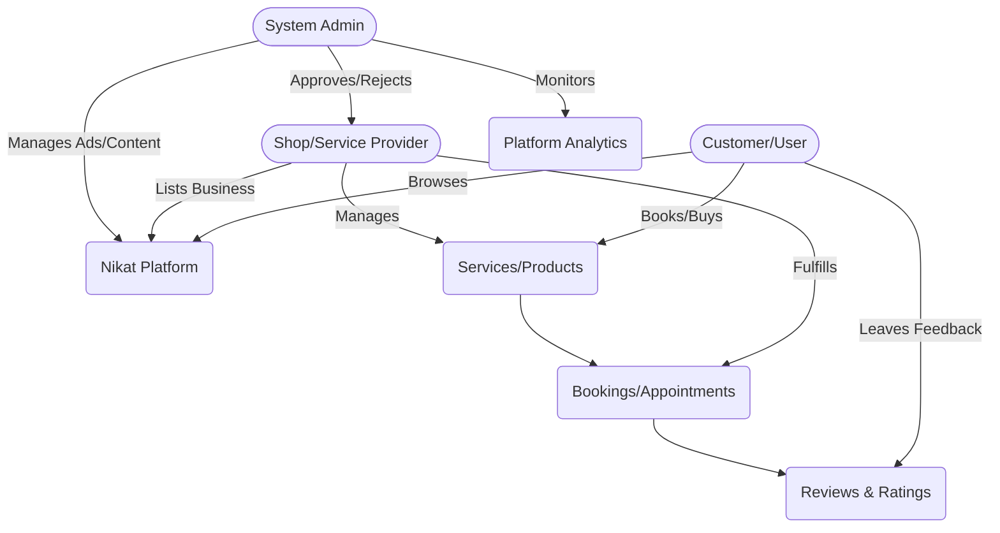
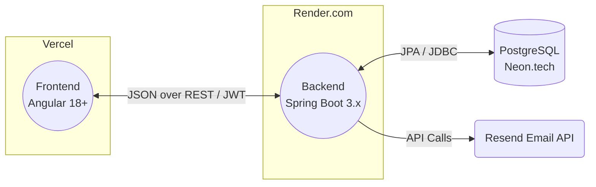

# Nikat - Project Documentation

## 1. Project Overview & Purpose
**Nikat** is a comprehensive, localized services and shops discovery platform designed to connect neighborhoods with premium services. It acts as a bridge between customers looking for specific services (like appliance repair) or products, and listed shops, technicians, or service providers. The purpose is to streamline local discovery, booking, and reviews all in one place through a modern, seamless digital experience.

## 2. Core Features & Roles
- **Users/Customers**: Can browse local shops and services, book appointments, leave reviews, and manage their profiles.
- **Shop Owners**: Can list their business, manage their services and operating hours, view appointments, and track analytics.
- **Service Providers / Technicians**: Can manage their offered services, receive service requests, and track their ratings.
- **Administrators**: Have a powerful dashboard to manage approvals, platform statistics, advertisements, user roles, security logs, and a community hub.

### Business Flowchart



## 3. Technology Stack & Architecture
This project uses a modern web stack optimized for scalable, free-tier hosting:
- **Frontend**: Angular 18+ (Standalone Components), utilizing dynamic theming, a dark-mode-first glassmorphic UI (Stitch Design System). Deployed on **Vercel**.
- **Backend**: Java 21 with Spring Boot 3.x, Spring Security 6 (JWT), Spring Data JPA. Deployed on **Render.com** via Docker.
- **Database**: PostgreSQL with SSL. Hosted on **Neon.tech**.
- **External APIs**: Resend API for email services.

The architecture is strictly decoupled: `frontend/` contains only the Angular app, communicating via RESTful JSON endpoints with the `backend/`. The backend acts as the single source of truth for all business logic, data persistence, and security validations.

### Architecture Flowchart



## 4. Repository & Module Breakdown
- `frontend/`: Contains the complete Angular application (UI, components, services, routes, assets, core UI state).
- `backend/`: Contains the complete Spring Boot API (controllers, services, repositories, security configs, domain models).
- `docs/agents/`: Dedicated directory for AI Agent guidelines, architecture details, data models, and workflows.

## 5. Development Setup & Environment Variables

### Environment Variables
**Frontend (`frontend/src/environments/environment.ts`)**
- `apiUrl`: Base URL for the Spring Boot API (e.g., `http://localhost:8080/api`)

**Backend (`backend/src/main/resources/application.properties` and `.env`)**
- `SUPABASE_DB_URL` / `NEON_DB_URL`: JDBC Database Connection String
- `DB_USERNAME`, `DB_PASSWORD`: Database Credentials
- `JWT_SECRET`, `JWT_EXPIRATION`: Token signing key and expiration
- `RESEND_API_KEY`: API key for sending emails

### Running Locally
1. **Database**: Ensure PostgreSQL is accessible and credentials are set in backend configuration.
2. **Backend**: 
   ```bash
   cd backend
   mvn clean install
   mvn spring-boot:run
   ```
3. **Frontend**:
   ```bash
   cd frontend
   npm install
   npm start
   ```

## 6. Deployment Flow
1. **Backend to Render**: A Dockerfile in the `backend/` directory builds the self-contained `.jar` and serves it on Render.
2. **Frontend to Vercel**: The `frontend/` directory is connected to Vercel which builds using `ng build --configuration production`.
3. **Database**: Automated migrations or JPA schema updates handled upon backend deployment to Neon.

## 7. Important Implementation Notes
- **Source of Truth**: All data and state validations must happen in the backend. The frontend is exclusively a presentation layer representing the state retrieved from the backend.
- **UI/UX Consistency**: Any new frontend component must follow the existing Deep Sea, glassmorphism design system to maintain visual parity.
- **Agent Interfacing**: Both human developers and AI Agents must follow the structured guidelines in `docs/agents/` to prevent regressions.